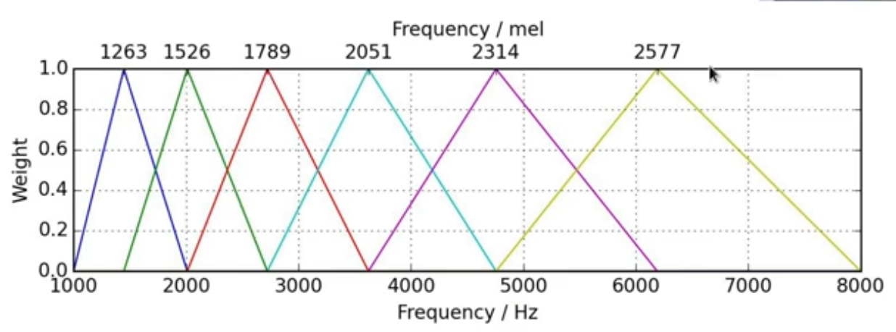

# RESOURCES AND LINKS
### DSP related stuff
- Used functions 
    - https://github.com/zafarrafii/Zaf-Matlab/blob/master/zaf.m
- Spectrograms 
    - https://www.youtube.com/watch?v=_FatxGN3vAM
- Mel Spectrograms 
    - https://www.youtube.com/watch?v=SJo7vPgRlBQ&pp=ygUIbWVsIHNwZWM%3D
    - https://www.youtube.com/watch?v=9GHCiiDLHQ4&t=116s&pp=ygUIbWVsIHNwZWM%3D
### Speech/Sound detection stuff
- YAMnet (detects sound) 
    - https://in.mathworks.com/help/audio/ref/yamnet.html
- Deepspeech (detects speech)
    - https://github.com/matlab-deep-learning/deepspeech

---

## Other notes
- Windowing is done to study the frequency props as time changes - STFT.
- Humans perceive sound not linearly, but as a log scale, mel is required.
- In Mel scale frequency is perceived linearly and 1000Hz = 1000Mel. (experimented result)
- Steps for spectrogram conversion 
    - Find upper and lower mel values.
    - Insert equally spaced points in between
    - Convert them into corresponding frequency values.
    
    - Note that each spike is located evenly.